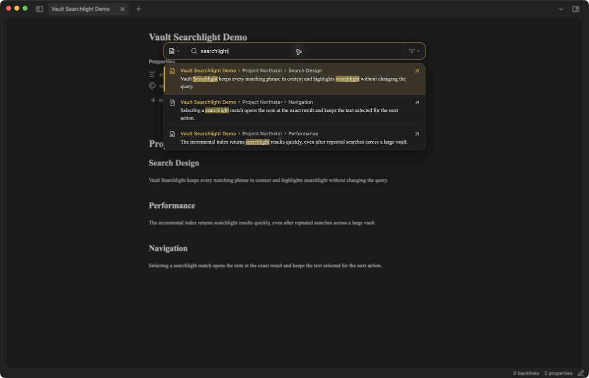

# Vault Searchlight for Obsidian

Vault Searchlight is a compact, theme-aware search and heading navigation plugin for the focused Markdown note or the entire vault. The query always stays untouched when switching scope—no injected `path:` prefix and no directory text.



## Features

- **This file / All files / Properties / Tags** search-mode dropdown with icons and a remembered file-search default.
- A middle-right heading navigator for the focused note, with H1–H6 badges, rendered Markdown titles, nesting context, and hidden-track scrolling.
- Heading searches keep the full outline visible and highlight matches in place; `Enter` cycles matches and `Shift+Enter` jumps to the selected heading.
- Rendered Markdown excerpts with theme-accent match highlights.
- File and Markdown-rendered heading hierarchy shown above every excerpt, including links and inline formatting.
- Exact quoted word and phrase matching, exclusions, `OR`, regex, and field operators.
- Optional fuzzy matching controlled only from the plugin settings.
- Optional heading-match exclusion hides heading-only result cards while retaining heading breadcrumbs.
- Optional Excalidraw Data exclusion omits generated drawing payload sections.
- Optional Excalidraw Data exclusion for the heading navigator hides that heading and its nested headings.
- Vault-relative paths and glob patterns can exclude files from every search mode.
- Ordinary file searches omit YAML properties and tag tokens; **Properties** searches and shows only YAML property content, while **Tags** searches and shows only tag values.
- Property and tag modes have dedicated commands and no separate settings toggles.
- Icon-only relevance, file name, location, and modified-date sorting. The chosen sort survives restarts.
- Unified segmented search bar with icon-only scope and sort controls; their menus retain descriptive text.
- Results appear in a separate theme-native panel with hidden-track scrolling and no command footer.
- No close control; click outside or press `Esc` to dismiss the search.
- Clicking a result opens its note and selects the exact match until the next editor action.
- Incremental in-memory indexing, debounced input, stale-search cancellation, and capped rendering for large vaults.
- Keyboard navigation and commands for every switchable option.

## Query syntax

| Syntax | Meaning |
| --- | --- |
| `atlas plan` | Both terms must occur in the file; matching lines are shown |
| `"project atlas"` | Exact phrase match |
| `"atlas"` | Exact whole-word match |
| `atlas OR roadmap` | Match either group |
| `atlas -draft` | Exclude matches containing `draft` |
| `/atlas\\s+plan/i` | JavaScript regular expression |
| `path:Research` | Filter by note path |
| `file:Atlas` | Filter by file name |
| `tag:project` | Filter by tag while using Tags mode |
| `section:Findings` | Filter by heading hierarchy |
| `content:atlas` or `line:atlas` | Match result-line content |
| `match-case:Atlas` | Match content with exact letter case |
| `ignore-case:atlas` | Explicitly match without case sensitivity |
| `path:/Daily.*2026/` | Use a regular expression inside an operator |
| `task:*` | Match tasks |
| `task-todo:*` | Match incomplete tasks |
| `task-done:*` | Match completed tasks |

Operators are optional. Changing search mode never modifies the search term. Properties and Tags search across the vault and isolate their respective content types.

## Commands and hotkeys

| Command |
| --- |
| Open search for current file |
| Open search for all files |
| Toggle current file / all files |
| Cycle result sorting |
| Open property search |
| Open tag search |
| Open heading navigator for current file |

Assign any shortcut you prefer in **Settings → Hotkeys → Vault Searchlight**. While the search panel is open, `F` toggles between current-file and all-files search, `S` cycles sorting, the arrow keys navigate results, and `Enter` opens the selected result. In the heading navigator, `Enter` cycles matching headings, `Shift+Enter` jumps to the selected heading, and the arrow keys move through the full outline.

## Settings

- **Fuzzy matching** enables inexact matching without adding a control to the search bar.
- **Exclude heading matches** hides search cards caused only by heading-line matches.
- **Exclude Excalidraw data** omits generated drawing content from ordinary search.
- **Excluded files** accepts one vault-relative file, folder, or glob per line, such as `Archive/`, `Private.md`, or `*.excalidraw.md`.
- **Exclude Excalidraw data from heading navigator** hides the Excalidraw Data outline branch.
- **Result limit** caps rendered results to keep repeated searches responsive.

## Installation

After the plugin is accepted into the Community Plugins directory:

1. Open **Settings → Community plugins → Browse** in Obsidian.
2. Search for **Vault Searchlight**, select it, and choose **Install**.
3. Enable the plugin.

For a manual installation, download `main.js`, `manifest.json`, and `styles.css` from the latest GitHub release and place them in:

`<vault>/.obsidian/plugins/vault-searchlight/`

Reload Obsidian, then enable **Vault Searchlight** under Community plugins.

## Privacy

Vault Searchlight performs indexing and searching locally inside Obsidian. It makes no network requests and includes no analytics or telemetry.

## Development

```bash
npm install
npm test
npm run build
```

For local development, symlink this project into that plugin directory and run `npm run dev`.

## License

[MIT](./LICENSE)
